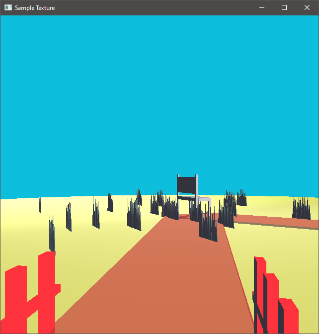
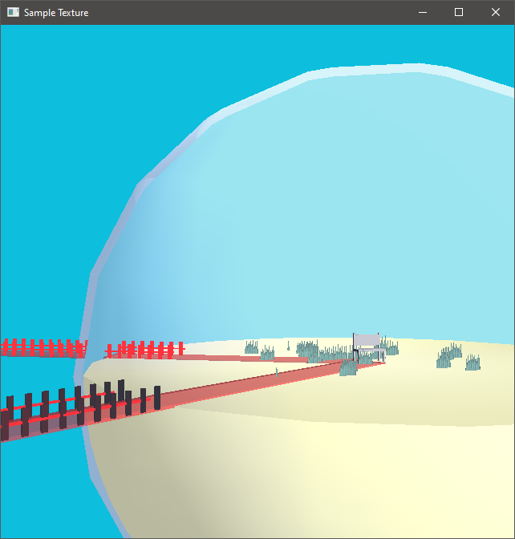
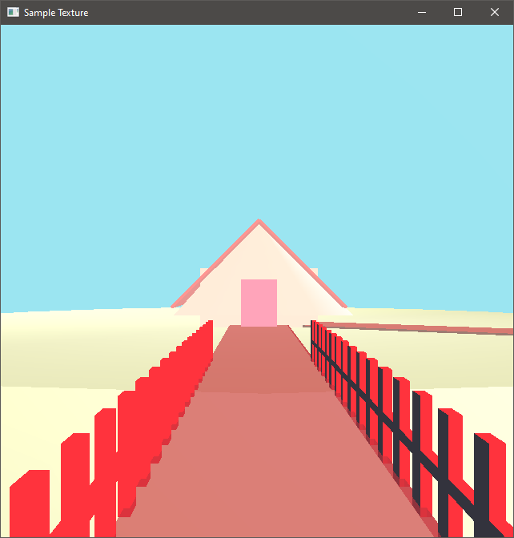
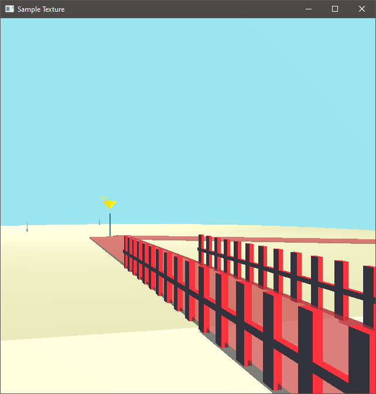
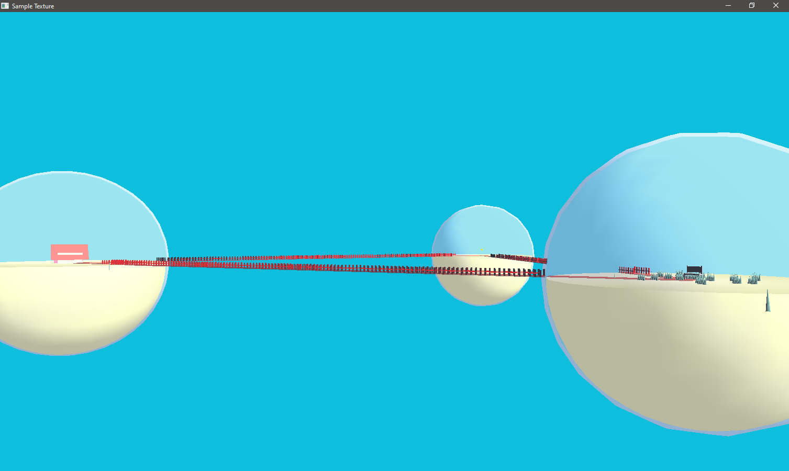

# CPE465_CG_FinalProject
Computer graphic final project

## Concept
คอนเซปโปรเจ๊คนี้คือ “ดินแดนต่างมิติ” เมื่อผู้ใช้เลื่อนกล้องเข้าไปใน World จะถูกล๊อกไม้ให้เห็นข้างนอก และภายใน World จะเป็นวัตถุกึ่งนามธรรมวางอยู่ตรงกลาง

## ความหลังกับภาพ
ชิ้นงานนี้จะเลือกใช้สีแนวพลาสเทิล ซึ่งกำหนดให้ ค่า ambient ของแสงจากแหล่งกำเนิดแสง0 เป็นเชรดสีเทา (0.8, 0.8 ,0.3) ซึ่งจะทำให้เงาของด้านไม่โดนแสง มีสีของวัตถุเดิมติดมาด้วย แทนที่จะเป็นสีดำ 

## จุดเด่น
งานชิ้นนี้มีการเล่นกับ Transparent เป็นส่วนมาก ซึ่งการจะทำให้วัตถุโปรแสงหมายความว่า OPENGL จะต้องให้ Vertext ที่อยู่ด้านหลังวัตถุโปร่งแสงสามารถแสดงขึ้นมาได้ แต่งานเราจะไม่ให้มันแสดงขึ้นมา เพื่อให้เสมือนว่า กล้องถูกตัดออกจากมิติเดิม 

## Key ในการเคลื่อนที่กล้อง
*   ใช้ลูกศรในการเคลื่อนที่เดินหน้าถอยหลัง หมุนซ้ายขวา
*   ใช้ Shift_L ในการยกมุมกล้อง
*   ใช้ Alt_L ในการปรับมุมกล้องลง
*   ใช้ F1 เพื่อสุ่มวัตถุมาใหม่

## ปัญหาที่พบ
*   หญ้าขึ้นน้อยในแต่ละ World ซึ่งไม่ถูกต้อง (แก้ไม่ทัน)
*   Transparent กินแรงเครื่องมาก ถ้าปรับ World หลายๆอัน อาจจะทำให้เครื่องค้าง (แก้เลขใน Code ได้เลย)

## ScreenShot

